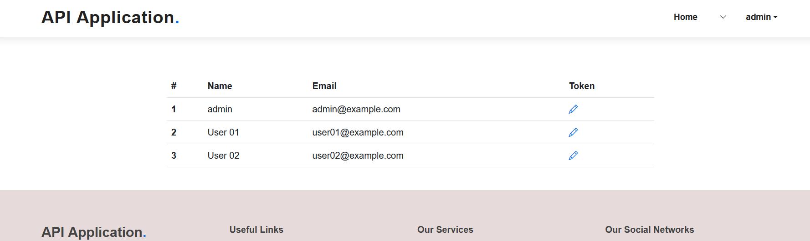
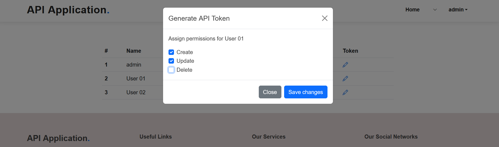

# Laravel REST API Example Using Sanctum

> **Note**: This a demo project, currently under development.

## About

This is a Laravel example project that uses Sanctum package to build a REST API.

## Models
- User
- Student
- Course
- Assignment


## Generate API Token

I developed a web page to manage generated Tokens
```
http://localhost:8000/admin/users
```

The response contains the plainTextToken and the Permissions as follows:
```
{
    "user":{"id":2,"name":"User 01","email":"user01@example.com","email_verified_at":null,"created_at":"2023-01-29T11:49:31.000000Z","updated_at":"2023-01-29T11:49:31.000000Z"},
    
    "token":{"accessToken":{"name":"access_token","abilities":["create","update"],"tokenable_id":2,"tokenable_type":"App\\Models\\User","updated_at":"2023-02-17T18:24:56.000000Z","created_at":"2023-02-17T18:24:56.000000Z","id":5},"plainTextToken":"THE_GENERATED_TOKEN"},
    
    "permissions":["create","update"]
}
```

## Requests Examples

* The following results are based on fake data from Laravel factory faker
* Due to size limitation, I deleted items from "data" array in the response 

### Retreive students' list

```
GET http://localhost:8000/api/V1/students
```
<details><summary>Check Results</summary>
<br>

```
{
    "data": [
        {
            "id": 1,
            "name": "Tom",
            "email": "test@test.test",
            "dateOfBirth": "1996-10-20",
            "major": "Math",
            "address": "test",
            "status": "active"
        },
        {
            "id": 2,
            "name": "Mac",
            "email": "test@test.test",
            "dateOfBirth": "1975-07-24",
            "major": "Law",
            "address": "test",
            "status": "active"
        },
        {
            "id": 3,
            "name": "Thelma",
            "email": "test@test.test",
            "dateOfBirth": "1985-12-24",
            "major": "Engineering",
            "address": "test",
            "status": "active"
        }
    ],
    "links": {
        "first": "http://localhost:8000/api/V1/students?page=1",
        "last": "http://localhost:8000/api/V1/students?page=2",
        "prev": null,
        "next": "http://localhost:8000/api/V1/students?page=2"
    },
    "meta": {
        "current_page": 1,
        "from": 1,
        "last_page": 2,
        "links": [
            {
                "url": null,
                "label": "&laquo; Previous",
                "active": false
            },
            {
                "url": "http://localhost:8000/api/V1/students?page=1",
                "label": "1",
                "active": true
            },
            {
                "url": "http://localhost:8000/api/V1/students?page=2",
                "label": "2",
                "active": false
            },
            {
                "url": "http://localhost:8000/api/V1/students?page=2",
                "label": "Next &raquo;",
                "active": false
            }
        ],
        "path": "http://localhost:8000/api/V1/students",
        "per_page": 15,
        "to": 15,
        "total": 28
    }
}
```

</details>

<br>

### Retreive students' list with their Assignments

```
GET http://localhost:8000/api/V1/students?assignments=true
```
<details><summary>Check Results</summary>
<br>

```
{
    "data": [
        {
            "id": 13,
            "name": "Prof. Rosemary Flatley",
            "email": "Ariane Hermann",
            "dateOfBirth": "1999-08-27",
            "major": "CS",
            "address": "75234 Iva Estates Apt. 945",
            "status": "active",
            "assignments": [
                {
                    "id": 3,
                    "courseId": 8,
                    "studentId": 13,
                    "grade": 29,
                    "openedAt": "2015-06-14 13:36:03",
                    "solvedAt": "2015-10-09 05:08:50"
                }
            ]
        },
        {
            "id": 14,
            "name": "Murray Will",
            "email": "Maxwell Kuhic",
            "dateOfBirth": "1975-01-24",
            "major": "Engineering",
            "address": "6371 Ondricka Lane",
            "status": "active",
            "assignments": [
                {
                    "id": 4,
                    "courseId": 9,
                    "studentId": 14,
                    "grade": 20,
                    "openedAt": "2017-10-03 08:16:05",
                    "solvedAt": "2003-05-26 13:02:53"
                }
            ]
        },
        {
            "id": 15,
            "name": "Mrs. Thelma Wiza",
            "email": "Jamey Nikolaus",
            "dateOfBirth": "1985-12-24",
            "major": "Engineering",
            "address": "6236 Deon Trace Suite 036",
            "status": "active",
            "assignments": [
                {
                    "id": 5,
                    "courseId": 10,
                    "studentId": 15,
                    "grade": 39,
                    "openedAt": "2015-08-23 10:02:14",
                    "solvedAt": "2016-04-03 17:40:44"
                }
            ]
        }
    ],
    "links": {
        "first": "http://localhost:8000/api/V1/students?assignments=true&page=1",
        "last": "http://localhost:8000/api/V1/students?assignments=true&page=2",
        "prev": null,
        "next": "http://localhost:8000/api/V1/students?assignments=true&page=2"
    },
    "meta": {
        "current_page": 1,
        "from": 1,
        "last_page": 2,
        "links": [
            {
                "url": null,
                "label": "&laquo; Previous",
                "active": false
            },
            {
                "url": "http://localhost:8000/api/V1/students?assignments=true&page=1",
                "label": "1",
                "active": true
            },
            {
                "url": "http://localhost:8000/api/V1/students?assignments=true&page=2",
                "label": "2",
                "active": false
            },
            {
                "url": "http://localhost:8000/api/V1/students?assignments=true&page=2",
                "label": "Next &raquo;",
                "active": false
            }
        ],
        "path": "http://localhost:8000/api/V1/students",
        "per_page": 15,
        "to": 15,
        "total": 28
    }
}
```

</details>

<br>

### Create a new Student

```
POST http://localhost:8000/api/V1/students
Authorization: Bearer TOKEN GOES HERE
Content-Type: application/json
Body:
    {
        "name": "Abd2222",
        "email": "abd@example.example",
        "date_of_birth": "1990-08-13",
        "address": "London",
        "major": "CS"
    }
```
<details><summary>Check Results</summary>
<br>

```
{
    "data": {
        "id": 35,
        "name": "Abd2222",
        "email": "abd@example.example",
        "dateOfBirth": "1990-08-13",
        "major": "CS",
        "address": "London",
        "status": null
    }
}
```
</details>

### Delete a Student

```
DELETE http://localhost:8000/api/V1/students/37
Authorization: Bearer TOKEN GOES HERE
Content-Type: application/json
```
<details><summary>Check Results</summary>
<br>

```
{
    "message": "The item was deleted successfully",
    "code": 200
}
```
</details>

### Create a new Student with Assignments

```
TODO
```

## Assigning Abilities

### When Generating the Token
```
$token = $user->createToken('access_token', $request->permissions);
```

### Protecting Methods
```
public function __construct()
{
    $this->middleware(['abilities:delete'])->only([
        'destroy'
    ]);
}
```

## Enabling Token Expire Time

You can modify config/Sanctum.php file to enable expire time, for example:
```
'expiration' => 5,
```

## Screenshots

### Users Management



<br>

### Users Management Generate Token



## Credits
* Thanks for **[Laravel](https://laravel.com/)** framework
* Thanks for **[BootstrapMade ](https://bootstrapmade.com/)** for the HTML template 
* Thanks for the **[REST API Tutrial](https://www.youtube.com/watch?v=YGqCZjdgJJk)** for explaining the Sanctum REST API
* Thanks for the **[User Roles Tutrial](https://www.youtube.com/watch?v=2u1bJWc9nN4)** for explaining the role management
* And many other great packages (check used libraries)

<br>

> **Disclaimer**: This considered a demo project, if you plan on using it, you should check it for performance, security and other quality assurance criteria.

## Licenses
* This project under the MIT License
* Please check all used licenses (from Frameworks and Libraries)